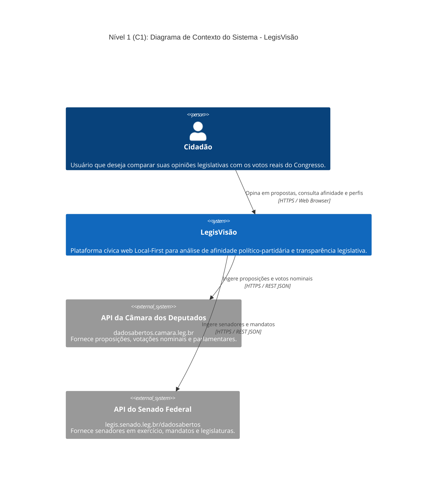
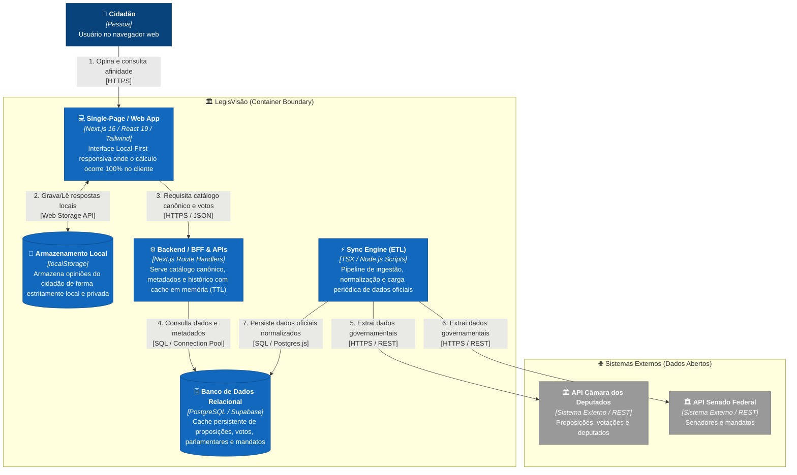
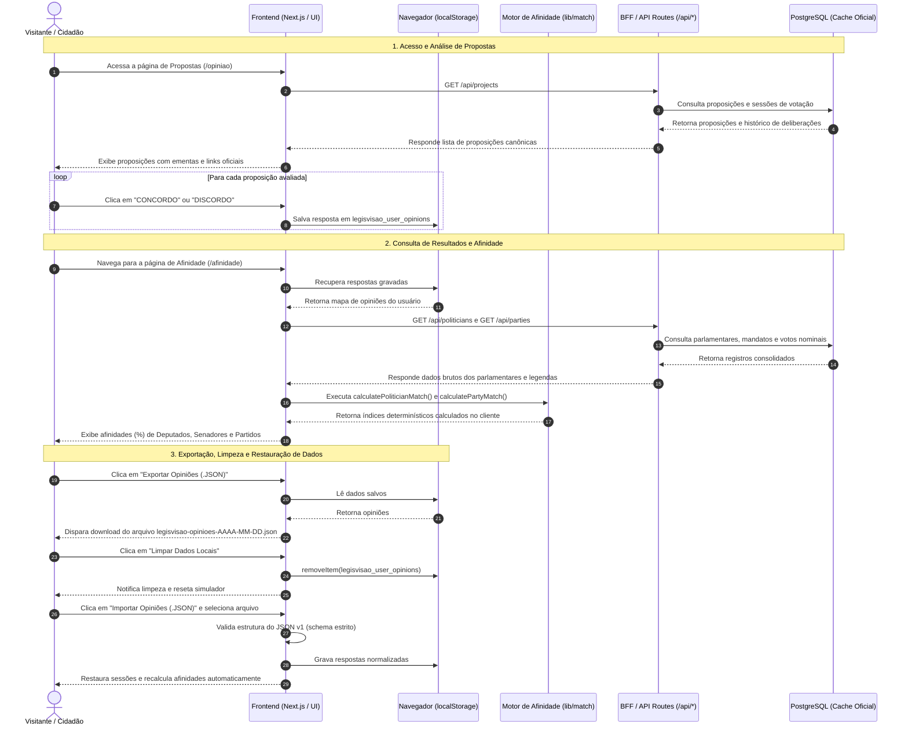
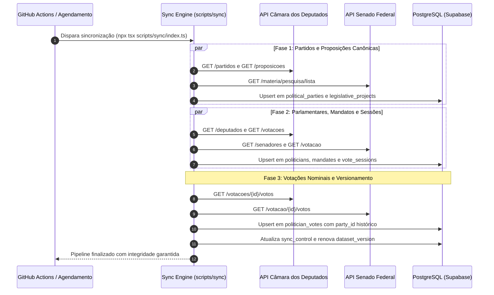
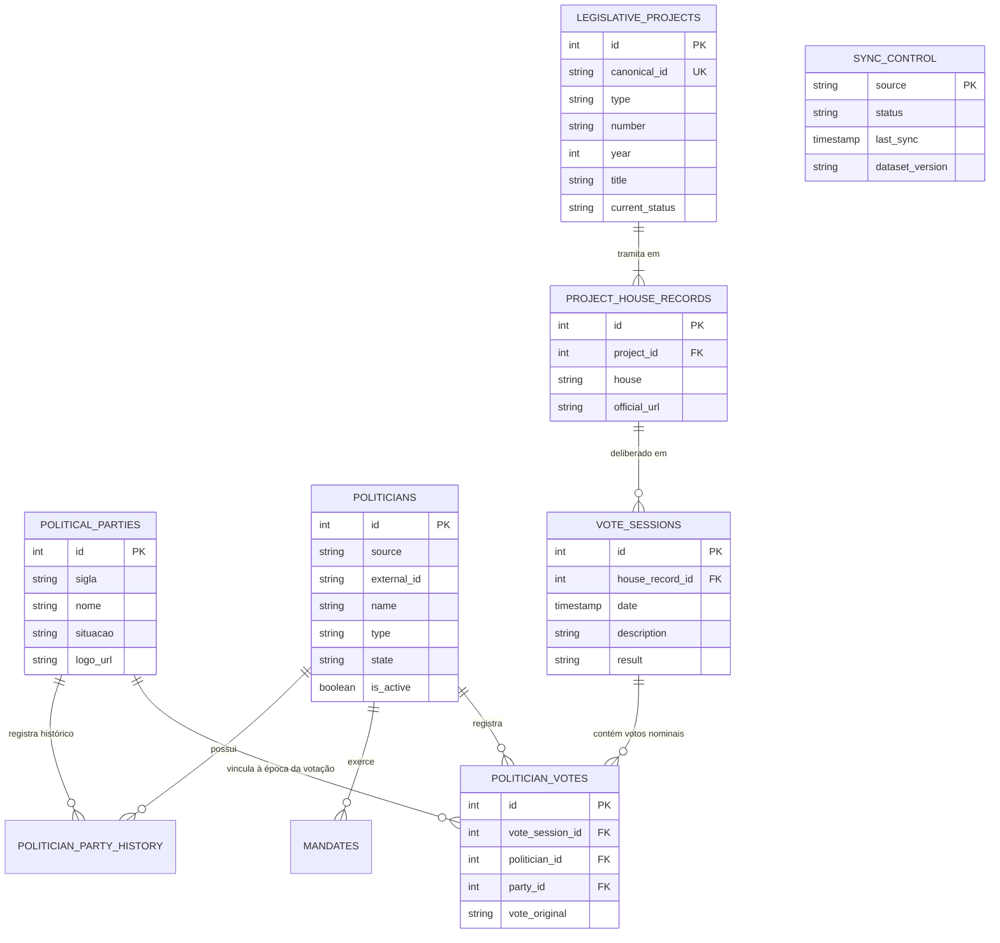

<div align="center">

# 🏛️ LegisVisão
### Plataforma Cívica de Transparência Legislativa e Análise de Afinidade

[](https://nextjs.org/)
[](https://react.dev/)
[](https://www.typescriptlang.org/)
[](https://tailwindcss.com/)
[](https://supabase.com/)
[](LICENSE)

<p align="center">
  <strong>Compare seu posicionamento cívico com os votos reais do Congresso Nacional.</strong><br>
  Uma aplicação <em>Local-First</em>, determinística, auditável e alimentada exclusivamente por dados públicos oficiais da Câmara dos Deputados e do Senado Federal.
</p>

[🌐 Acessar LegisVisão](https://legisvisao.com.br) • [🐛 Reportar Problema](https://github.com/didifive/legisvisao/issues) • [⭐ Repositório GitHub](https://github.com/didifive/legisvisao)

</div>

---

## 📖 Visão Geral

O **LegisVisão** é uma plataforma cívica de código aberto desenvolvida para aproximar a sociedade civil das decisões do Poder Legislativo Brasileiro (Bicameralismo).

A aplicação permite que qualquer cidadão opine (**CONCORDO** ou **DISCORDO**) sobre proposições legislativas reais (PL, PEC, PLP, MPV deliberadas no Congresso Nacional) e compare seus posicionamentos de forma determinística com os votos nominais registrados por Deputados Federais, Senadores e Partidos Políticos.

A ferramenta é orientada pela **privacidade absoluta (*Local-First*)**: nenhuma resposta do usuário é enviada para servidores ou gravada em bancos de dados remotos.

---

## 🎯 Princípios Fundamentais

1. **Fonte de Verdade Pública**: Os dados provêm exclusivamente das APIs abertas da Câmara dos Deputados e do Senado Federal. O banco de dados relacional funciona estritamente como cache persistente de leitura e normalização.
2. **Cálculo Determinístico e Aberto**: O índice de afinidade é uma divisão aritmética direta (`Concordâncias / Comparações Válidas × 100`). Não há inteligência artificial no cálculo, pesos ocultos ou algoritmos opacos.
3. **Privacidade Local-First**: O armazenamento de respostas ocorre 100% no `localStorage` do navegador do visitante.
4. **Neutralidade Cívica**: A plataforma não emite juízo de valor, não ranqueia representantes por mérito e não faz recomendação eleitoral.

---

## 🏗️ Arquitetura do Sistema (C4 Model)

A arquitetura do **LegisVisão** é documentada seguindo o modelo **C4 (Context & Containers)**, priorizando clareza estrutural e desacoplamento:

### 1. Nível 1: Diagrama de Contexto do Sistema (C1)
Apresenta o ecossistema geral, os usuários e as interações com os sistemas externos de dados abertos governamentais.



---

### 2. Nível 2: Diagrama de Contêineres (C2)
Detalha as aplicações, serviços, orquestradores de dados e armazenamentos que compõem a solução do LegisVisão.



---

## 🔄 Fluxos de Execução e Sequência

### 1. Jornada do Cidadão (Votação e Afinidade Local-First)
Demonstra o ciclo de vida da navegação, gravação estritamente local e cálculo determinístico no cliente:



---

### 2. Pipeline de Ingestão e Sincronização Governamental (ETL)
Demonstra como o orquestrador de sincronização consome os dados abertos, normaliza as votações e controla a versão do dataset:



---

## 🗄️ Modelo de Dados Relacional (DER)

O esquema relacional é projetado para garantir integridade referencial, rastreabilidade temporal de mandatos e fidelidade partidária no exato momento do voto:



---

## 📐 Metodologia de Cálculo e Normalização

### 1. Normalização de Votos
Apenas votos com posicionamento expresso de mérito entram no cômputo:
- **Afirmativos ("SIM")**: `"SIM"`, `"S"`, `"Y"`, `"YES"`, `"CONCORDO"`, `"FAVORAVEL"`, `"SIM-SIM"`.
- **Negativos ("NÃO")**: `"NAO"`, `"NÃO"`, `"N"`, `"NO"`, `"DISCORDO"`, `"CONTRARIO"`, `"NAO-NAO"`.
- **Valores Desconsiderados (`null`)**: Abstenção, Obstrução, Art. 17, Licença, Falta, Ausência, Liberado, Outros.

### 2. Afinidade Individual do Parlamentar
$$\text{Índice Individual (\%)} = \left( \frac{\text{Total de Concordâncias}}{\text{Total de Deliberações Válidas Comparáveis}} \right) \times 100$$

### 3. Afinidade Partidária (com Fidelidade Direta no Voto)
$$\text{Índice do Partido (\%)} = \left( \frac{\text{Total de Concordâncias dos Parlamentares Filiados}}{\text{Total de Votos Comparáveis dos Filiados}} \right) \times 100$$

> **Fidelidade Histórica de Filiação**: Cada voto nominal é atribuído diretamente à legenda partidária em que o parlamentar estava registrado no momento da sessão de deliberação (`politician_votes.party_id`, extraído do painel oficial de votações). Se um político trocou de legenda, seus votos anteriores permanecem vinculados ao partido em que atuava na data do voto, e os novos votos são computados para a sua legenda atual.
>
> **Efeito em Partidos Recentes**: Partidos criados recentemente ou resultantes de fusões, como União Brasil (DEM + PSL) e PRD (PTB + Patriota), são considerados apenas a partir de sua constituição formal. Assim, votos registrados antes da criação da nova legenda permanecem atribuídos aos partidos existentes à época da votação e não são transferidos retroativamente para o partido sucessor. Por exemplo, votos anteriores continuam vinculados a legendas como DEM, PSL, PTB e Patriota.
>
> **Critério de Desempate no Ranking**: Em caso de empate no percentual de afinidade entre legendas ou parlamentares, o primeiro critério de desempate é o maior número de votos comparáveis considerados, privilegiando resultados baseados em uma amostra mais ampla e estatisticamente mais robusta.

---

## 🛠️ Tecnologias Utilizadas

- **Framework**: [Next.js 16 (App Router)](https://nextjs.org/)
- **Linguagem**: [TypeScript 5](https://www.typescriptlang.org/)
- **Interface**: [React 19](https://react.dev/), [Tailwind CSS 4](https://tailwindcss.com/) e [React Icons](https://react-icons.github.io/react-icons/)
- **Banco de Dados**: [PostgreSQL (Supabase)](https://supabase.com/) com driver `postgres` (Postgres.js)
- **Ingestão e Scripts**: [TSX](https://github.com/privatenumber/tsx)
- **Fontes de Dados**:
  - [API da Câmara dos Deputados](https://dadosabertos.camara.leg.br/swagger/api.html)
  - [API do Senado Federal](https://legis.senado.leg.br/dadosabertos/docs/ui/index.html)

---

## 🚀 Como Executar o Projeto Localmente

### Pré-requisitos
- **Node.js**: v20+
- **NPM**, **PNPM** ou **Yarn**
- Instância **PostgreSQL** ou projeto no **Supabase**

### 1. Clonar o Repositório
```bash
git clone https://github.com/didifive/legisvisao.git
cd legisvisao
```

### 2. Instalar Dependências
```bash
npm install
```

### 3. Configurar Variáveis de Ambiente
Crie um arquivo `.env.local` na raiz:
```env
DATABASE_URL="postgresql://postgres:[SENHA]@[HOST]:5432/postgres"
NEXT_PUBLIC_APP_URL="http://localhost:3000"
```

### 4. Aplicar Migrations no Banco de Dados
```bash
npm run migrate:push
```

### 5. Sincronizar Dados Oficiais
Execute o orquestrador completo para ingestão dos dados governamentais:
```bash
npx tsx scripts/sync/index.ts
```

### 6. Iniciar Servidor de Desenvolvimento
```bash
npm run dev
```
Acesse [http://localhost:3000](http://localhost:3000) no seu navegador.

### 7. Validação de Tipos e Build de Produção
```bash
npx tsc --noEmit
npm run build
npm run start
```

---

## 📁 Estrutura de Diretórios

```
├── app/
│   ├── afinidade/           # Página de Visualização de Afinidades e Filtros
│   ├── api/                 # Endpoints REST (BFF com cache)
│   │   ├── metadata/        # Metadados e contagens globais
│   │   ├── parties/         # Consulta e detalhes de partidos e bancadas
│   │   ├── politicians/     # Consulta de parlamentares e histórico nominal
│   │   ├── projects/        # Catálogo de proposições e sessões de voto
│   │   ├── states/          # Lista de UFs disponíveis
│   │   ├── sync-status/     # Monitor de atualização das fontes oficiais
│   │   └── version/         # Versão do dataset canônico ativo
│   ├── components/          # Componentes visuais globais (Header, Footer, ThemeToggle)
│   ├── faq/                 # Página de Transparência, FAQ e Monitor de Fontes
│   ├── opiniao/             # Simulador de Votação e Revisão de Opiniões
│   ├── partidos/            # Páginas de Detalhes dos Partidos
│   ├── politicos/           # Páginas de Detalhes e Votações Nominais dos Parlamentares
│   ├── globals.css          # Design tokens, tema escuro/claro e utilitários
│   ├── layout.tsx           # Layout raiz com ThemeProvider
│   └── page.tsx             # Página inicial institucional
├── lib/
│   ├── match/               # Motor de cálculo determinístico e normalização
│   ├── cache.ts             # Cache client-side em memória com TTL
│   ├── db.ts                # Conexão singleton com PostgreSQL
│   ├── server-cache.ts      # Cache server-side em memória com TTL
│   ├── storage.ts           # Gerenciamento de localStorage e JSON v1
│   └── useDataVersion.ts    # Hook de invalidação automática de cache
├── scripts/
│   ├── sync/                # Rotinas de ingestão das APIs governamentais
│   │   ├── client.ts        # Cliente HTTP com retentativas e logger
│   │   ├── index.ts         # Orquestrador geral de sincronização
│   │   ├── sync-parties.ts  # Ingestão de partidos políticos
│   │   ├── sync-politicians.ts # Ingestão de deputados federais e senadores
│   │   ├── sync-projects.ts # Ingestão de proposições canônicas
│   │   ├── sync-vote-sessions.ts # Ingestão de sessões de deliberação
│   │   └── sync-votes.ts    # Ingestão de votos nominais brutos
├── supabase/
│   └── migrations/          # Migrations SQL versionadas
└── types/
    └── db.ts                # Tipagens TypeScript do schema de dados
```

---

## ⚖️ Termos de Uso e Neutralidade Cívica

> **Esta ferramenta não recomenda representantes. Apenas compara dados públicos.**

- **Finalidade Cívica e Educacional**: O **LegisVisão** é uma ferramenta de transparência pública, sem fins lucrativos ou vínculos com partidos políticos.
- **Vedações**: É estritamente vedado o uso desta plataforma, de seus relatórios, marca ou índices para fins de **propaganda eleitoral, campanhas político-partidárias ou promoção de candidaturas**.
- **Auditoria de Código**: O código-fonte é aberto sob a licença MIT para permitir auditoria independente de toda a lógica e dos dados coletados.

---

## 📄 Licença

Este projeto é licenciado sob a [MIT License](LICENSE).

---

## 👨‍💻 Autor

Desenvolvido por **Luis Zancanela**.

- 🌐 Website: [zancanela.dev.br](https://zancanela.dev.br)
- 💼 LinkedIn: [linkedin.com/in/luis-zancanela](https://www.linkedin.com/in/luis-zancanela)
- 🐙 GitHub: [@didifive](https://github.com/didifive)
- 📧 Contato: [luis@zancanela.dev.br](mailto:luis@zancanela.dev.br)
